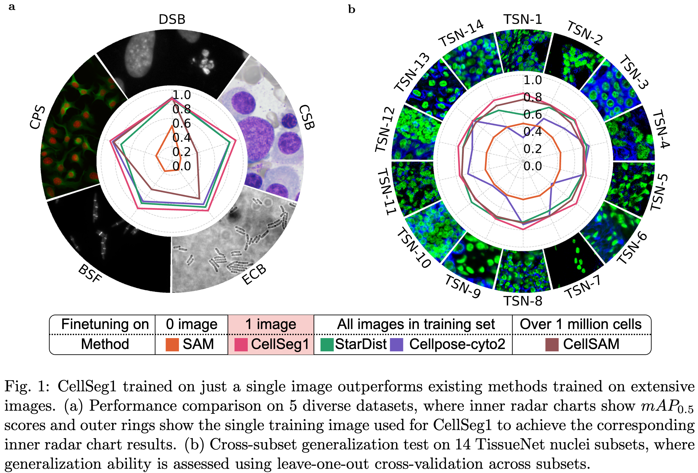
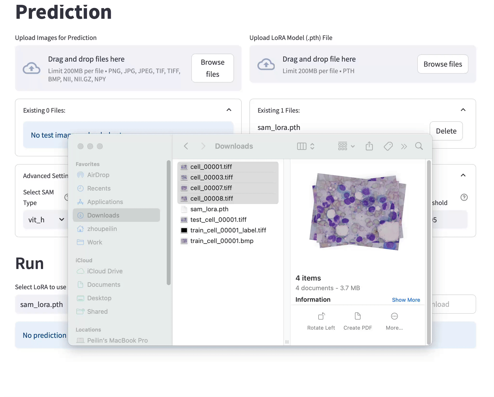
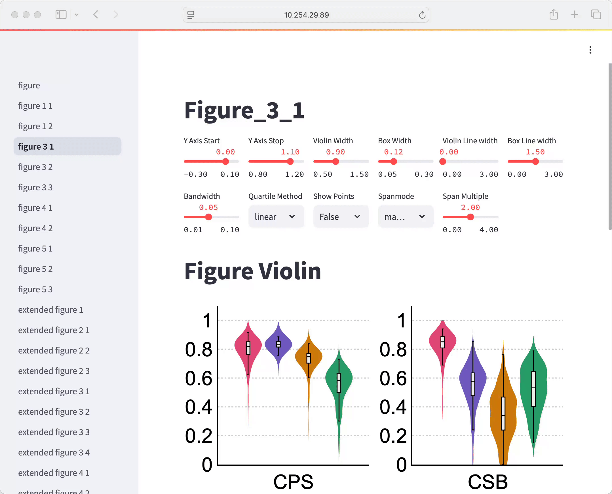
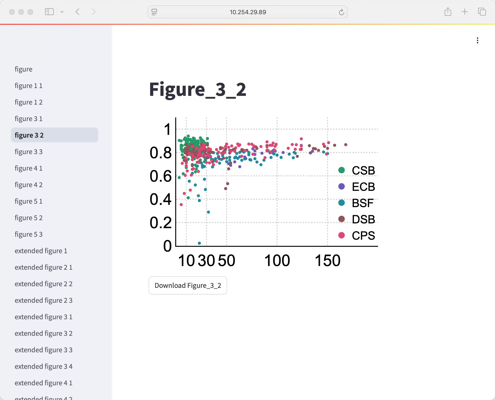

# CellSeg1: Efficient Cell Segmentation with Only One Training Image

[](https://www.python.org/downloads/release/python-3127/)
[](https://pytorch.org/)

CellSeg1 is a practical solution for segmenting cells of arbitrary morphology and modality using just a few dozen cell annotations in one image. By leveraging the Segment Anything Model (SAM) and adopting Low-Rank Adaptation, CellSeg1 achieves robust cell segmentation across diverse cell types and imaging conditions, achieving mean 0.81 mAP at 0.5 IoU when tested on 19 diverse cell datasets.



## Key Features
- Requires only one training image with a few dozen cell annotations
- Works with diverse cell types and imaging modalities
- Achieves comparable performance to models trained on hundreds of images
- Demonstrates superior cross-dataset generalization
- User-friendly GUI for training, testing, and visualization

## Prerequisites
- NVIDIA GPU with 8GB+ VRAM

## Quick Start Guide

### 1. Installation

```bash
# Create and activate conda environment
conda create -n cellseg1 python=3.12.7
conda activate cellseg1

# Install PyTorch with CUDA support
conda install pytorch==2.5.1 torchvision==0.20.1 torchaudio==2.5.1 pytorch-cuda=12.4 -c pytorch -c nvidia

# Install other requirements
pip install -r requirements.txt
```

### 2. Download SAM Backbone
1. Download the SAM model checkpoint from [SAM](https://github.com/facebookresearch/segment-anything#model-checkpoints)
2. Place it in `/path_to_your_code_folder/cellseg1/streamlit_storage/sam_backbone/`

### 3. Set Environment
```bash
export PYTHONPATH=/path_to_your_code_folder/cellseg1/
```

### 4. Launch GUI
```bash
streamlit run gui/Welcome.py
```
Access the interface at `http://127.0.0.1:8501`

<p align="center">
  
  
  
</p>

## Reproducing Paper Results

To reproduce the exact results from our paper, follow these steps:

### Environment Requirements
- Ubuntu 22.04
- NVIDIA RTX 4090
- Python 3.12.7, PyTorch 2.5.1 and its CUDA dependencies
- Strictly follow versions in requirements.txt

Note: Results may vary slightly without meeting these exact requirements.

### 1. Dataset Preparation

Download the following datasets:
- Data Science Bowl 2018 (DSB): [Download](https://github.com/stardist/stardist/releases/download/0.1.0/dsb2018.zip)
- Cellpose (CPS, CPG): [Download](https://www.cellpose.org/dataset)
- DeepBacs (ECB): [Download](https://zenodo.org/records/5550935)
- DeepBacs (BSF): [Download](https://zenodo.org/records/5550968)
- CellSeg-Blood (CSB): [Download](https://zenodo.org/records/10719375)
- TissueNet (TSN): [Download](https://datasets.deepcell.org/data)

Create the following directory structure:
```
/path_to_your_data_folder/cellseg1/
├── DeepBacs_Data_Segmentation_B.subtilis_FtsZ_dataset.zip
├── DeepBacs_Data_Segmentation_E.coli_Brightfield_dataset.zip
├── dsb2018.zip
├── test.zip
├── train.zip
├── Training-labeled.zip
├── Tuning.zip
└── tissuenet_v1.1.zip
```

### 2. Configure Data Path
Modify `DATA_ROOT` in `project_root.py`:
```python
DATA_ROOT = '/path_to_your_data_folder/cellseg1'  # Update this path
```
Export python path:
```bash
export PYTHONPATH=/path_to_your_code_folder/cellseg1/
```

### 3. Process Datasets
```bash
for file in CPG CPS BSF ECB DSB CSB TSN generate_data_statistics; do
    python experiment_in_paper/dataset/${file}.py
done
```

This will create a standardized structure for each dataset:
```
/path_to_your_data_folder/cellseg1/dataset_name/
├── train/
│   ├── images/
│   └── masks/
└── test/
    ├── images/
    └── masks/
```

### 4. Generate Configurations
```bash
python experiment_in_paper/robustness/generate_config.py
python experiment_in_paper/train_image_numbers/generate_config.py
python experiment_in_paper/vit_size/generate_config.py
python experiment_in_paper/batch_size/generate_config.py
```

### 5. Run Experiments
Before running experiments, modify the ray scripts in `experiment_in_paper/ray/` to specify which GPU to use.
```python
os.environ["CUDA_VISIBLE_DEVICES"] = "0,1,2,3,4,5,6,7"
```
Then execute the following commands in sequence:
```bash
# Training (requiring several days on 8 RTX 4090 GPUs)
python experiment_in_paper/ray/ray_train.py

# Generate predictions
python experiment_in_paper/ray/ray_predict.py

# Run evaluation
python experiment_in_paper/ray/ray_eval.py
```

For cross-domain predictions and evaluations on TSN and CPG datasets:

```bash
python experiment_in_paper/ray/ray_predict_generalization_TSN.py
python experiment_in_paper/ray/ray_eval_generalization_TSN.py
python experiment_in_paper/ray/ray_predict_generalization_CPG.py
python experiment_in_paper/ray/ray_eval_generalization_CPG.py
```

Trained LoRA models and predicted masks will be saved in `/path_to_your_data_folder/cellseg1/dataset_name/cellseg1/`.

Evaluation results will be stored in `experiment_in_paper/result/`.

### 6. Generate Paper Figures
Organize and reformat the results from `experiment_in_paper/result/` into the required format under `figures/data/`, or use existing data files in `figures/data/`.

Run the visualization interface:
```bash
streamlit run figures/figure.py
```
View the generated figures by accessing http://127.0.0.1:8501 in your browser

<p align="center">
  
  
</p>

<p align="center">
  
  
</p>

## Pre-trained Checkpoints

We provide five pre-trained LoRA checkpoints, each trained on a single image from different datasets as demonstrated in Figure 1a of our paper.

| Dataset | Checkpoint                                            | $mAP_{0.5}$ |
| ------- | ----------------------------------------------------- | ----------- |
| CPS     | [Download](checkpoints/cellpose_specialized_12.pth)   | 0.916739    |
| CSB     | [Download](checkpoints/cellseg_blood_117.pth)         | 0.940669    |
| ECB     | [Download](checkpoints/ecoli_brightfield_9.pth)       | 0.860465    |
| BSF     | [Download](checkpoints/bsubtilis_fluorescence_75.pth) | 0.821372    |
| DSB     | [Download](checkpoints/dsb2018_435.pth)               | 0.872526    |

Note that these checkpoints are LoRA weights only and require the base SAM model to function. Make sure you have downloaded the SAM backbone as specified in the installation instructions.

If you cannot exactly reproduce these results, please verify that your hardware and software environment strictly matches our specifications and ensure that the random seed is set to 0. Minor variations in results may occur with different environments.

## Notes

### Dependencies
- **Critical**: Use albumentations version 1.3.1. While other versions may run, they may contain bugs that can degrade model performance.

### GUI Access
- When using `streamlit run`, Streamlit will display the actual accessible IP and port
- Replace `http://127.0.0.1:8501` with the displayed address for remote access

### Figures Visualization
- Some figures in the visualization interface require predicted mask files to display properly
- Some figure pages have a "Save Images" checkbox that will save images to `/path_to_your_code_folder/cellseg1/saved_images` when selected

### GPU Memory and Batch Size Settings
- 8GB VRAM: Try `batch_size=1` with `gradient_accumulation=32`
- 12GB VRAM: Try `batch_size=2` with `gradient_accumulation=16`
- 24GB VRAM: Try `batch_size=4` with `gradient_accumulation=8`
- For detailed analysis of memory usage and training efficiency with different batch sizes, please refer to Extended Figure 5 in our paper.

### Training and Prediction Sessions
- Browser can be closed during training/prediction - progress will be preserved
- Reopening the browser should restore the current training/prediction state

### Troubleshooting
If you encounter persistent issues that cannot be resolved by restarting the program, try deleting these files from `/path_to_your_code_folder/cellseg1/streamlit_storage/`:
- training_state.json
- training_progress.json
- training_stop_flag
- prediction_state.json
- prediction_progress.json
- prediction_stop_flag

Then restart the program.

## Acknowledgement
We sincerely thank [SAM](https://github.com/facebookresearch/segment-anything), [SAMed](https://github.com/hitachinsk/SAMed), [Cellpose](https://github.com/MouseLand/cellpose), [pyCirclize](https://github.com/moshi4/pyCirclize/tree/main) for providing their code to the community!

## License
Our code is licensed under the Apache 2.0 license.
Copyright (c) 2024 Peilin Zhou.

Please note some files include code from:
- [SAM](https://github.com/facebookresearch/segment-anything) - Copyright (c) Meta Platforms, Inc. and affiliates.
- [SAMed](https://github.com/hitachinsk/SAMed) - Copyright (c) 2023 Kaidong Zhang
- [Cellpose](https://github.com/MouseLand/cellpose) - Copyright (c) 2020 Howard Hughes Medical Institute
- [pyCirclize](https://github.com/moshi4/pyCirclize/tree/main) - Copyright (c) 2022 moshi

Please refer to the individual source files for specific license details.

## Citation

If you use this code for your research, please cite our paper:

```bibtex
@article{zhou2024cellseg1,
  title   = {CellSeg1: Robust Cell Segmentation with One Training Image},
  author  = {Peilin Zhou and Bo Du and Yongchao Xu},
  journal = {arXiv preprint arXiv:2412.01410},
  url     = {https://arxiv.org/abs/2412.01410},
  year    = {2024}
}
```